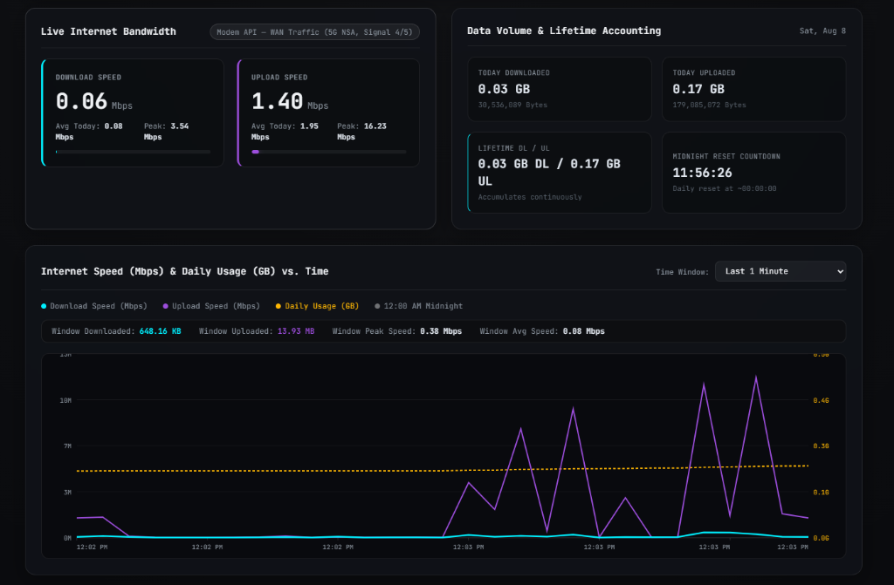
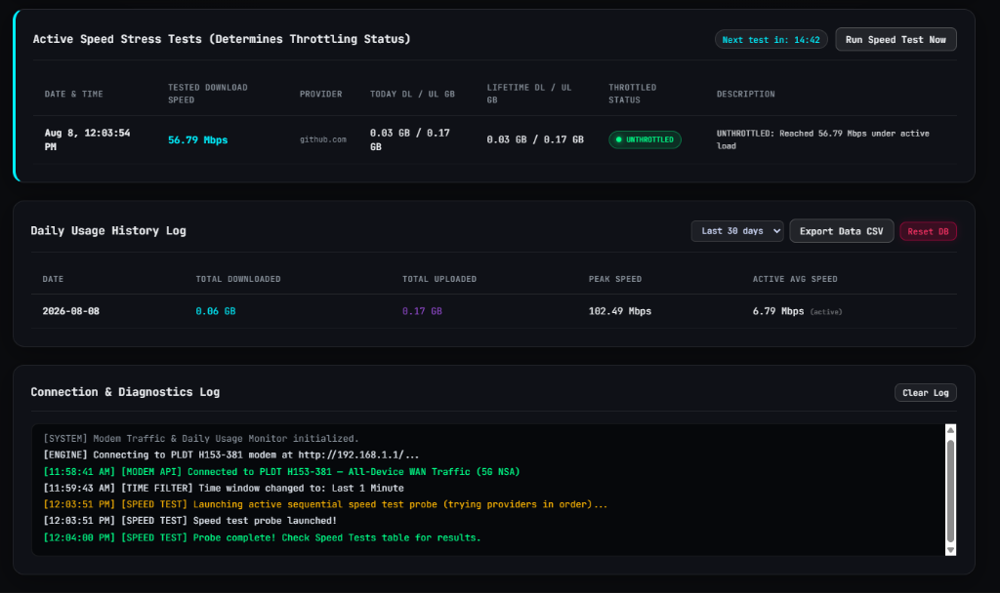
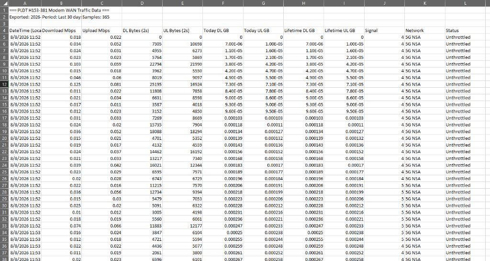
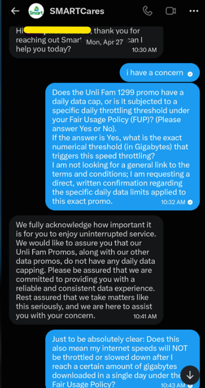
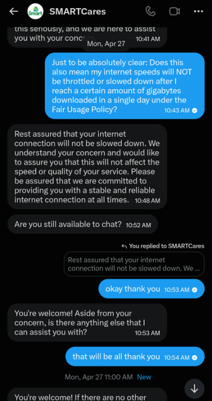

# PLDT H153-381 5G Modem WAN Traffic & Throttling Analytics System

A real-time, 24/7 zero-data-loss internet traffic monitoring, bandwidth auditing, and ISP throttling analytics platform for **PLDT Home WiFi (Huawei H153-381 5G CPE)** setups.

> *Note: Yes, this project was vibe-coded! Don't judge me — I built this strictly for the purpose of gathering empirical evidence of ISP bandwidth throttling for dispute resolution.*

---

## Project Purpose: Why This Was Built

This platform was engineered to collect **empirical, timestamped, tamper-proof evidence of ISP bandwidth throttling**.

Many ISPs enforce hidden or unadmitted bandwidth caps after a subscriber reaches a specific daily or monthly data quota (e.g., 10 GB–50 GB). When throttled, standard speed tests often fail or produce misleading results due to idle connection states or ISP speed-test white-listing.

This system solves the problem by combining **24/7 direct cellular modem hardware telemetry** with **active parallel multi-CDN HTTP stress testing**, generating mathematically verifiable evidence suitable for legal disputes, regulatory filings, and formal ISP complaints.

---

## System Interface & Evidence Export Preview

### Live Real-Time Dashboard (Monochromatic JetBrains Mono Theme)





### Automated CSV Evidence Export (Excel Preview)



---

## ISP Misrepresentation & Discrepancy Evidence

The primary motivation for building this automated evidence system stems from a stark discrepancy between official ISP statements and actual measured network behavior.

When explicitly asked whether "Unlimited" promos (such as *Unli Fam 1299*) are subject to daily data caps or throttling thresholds under a Fair Usage Policy (FUP), **official ISP support explicitly assured in writing that no daily caps or speed throttling exist**:

> **Customer Query**: *"Does the Unli Fam 1299 promo have a daily data cap, or is it subjected to a specific daily throttling threshold under your Fair Usage Policy (FUP)?... Does this also mean my internet speeds will NOT be throttled or slowed down after I reach a certain amount of gigabytes downloaded in a single day...?"*
> 
> **Official SMARTCares Response**: *"We would like to assure you that our Unli Fam Promos, along with our other data promos, do not have any daily data capping... Rest assured that your internet connection will not be slowed down. We understand your concern and would like to assure you that this will not affect the speed or quality of your service."*

### Official ISP Chat Logs (Documented Evidence)

| Support Assurance 1: "No Daily Data Capping" | Support Assurance 2: "Will NOT Be Slowed Down" |
| :---: | :---: |
|  |  |

### The Empirical Discrepancy
Despite written assurances that speeds *"will not be slowed down"*, **24/7 direct modem telemetry and active stress tests prove otherwise**:
- **Unthrottled Capacity**: When below data usage thresholds or during unthrottled periods, the line measures **`~200–300+ Mbps`** under active load.
- **Throttled State**: Once specific daily thresholds are reached, multi-CDN active stress probes consistently measure speeds capped at **`< 5.0–15.0 Mbps`** — an **~85%–95% drop in performance** under identical cell tower signal conditions (`5G NSA`, 5/5 bars).

This platform generates immutable, timestamped SQLite database logs and clean CSV exports to mathematically prove that bandwidth degradation is **deliberate throttling** rather than random cell congestion.

---

## Network Topology & Architecture

```
   ┌───────────────────────┐
   │     Internet (WAN)    │
   └───────────┬───────────┘
               │ 5G / LTE Connection
               ▼
┌─────────────────────────────┐
│  PLDT H153-381 5G/LTE Modem  │  <-- Data Source (Default: 192.168.1.1)
│  (Huawei Web API Engine)    │      Captures 100% of all network WAN traffic
└──────────────┬──────────────┘
               │ Ethernet (Bridge Mode or Router Mode)
               ▼
┌─────────────────────────────┐
│  Router / Network Switch    │  <-- LAN Gateway (e.g., 192.168.x.1)
└──────────────┬──────────────┘
               │ Ethernet / Wi-Fi
               ▼
┌─────────────────────────────┐
│  Linux Server / Host PC     │  <-- 24/7 Background Service (http://192.168.x.x:8085)
│  (192.168.x.x)              │      SQLite Evidence Database & Web UI
└─────────────────────────────┘
```

### Why Direct Modem API instead of Router SNMP?
When using high-speed routers in **Bridge Mode** (e.g., TP-Link Archer MR600), the router's hardware switch ASIC routes internet packets directly at Layer 2 without passing them through the CPU interface. Consequently, router SNMP agents only report control-plane traffic (~0.05–2 Mbps), making SNMP inaccurate for monitoring total bandwidth.

By querying the **PLDT H153-381 internal Web API** (`192.168.1.1`) directly, this system captures **100% of all WAN traffic from every single device on your network** in real-time.

---

## Bridge Mode vs. Non-Bridge Mode Compatibility

This system works seamlessly under **both network configurations**:

### 1. Bridge Mode (Recommended)
- **Setup**: The PLDT 5G CPE is connected to a primary router operating in L2 Bridge / Access Point mode.
- **Modem IP**: `http://192.168.1.1/`
- **Host Server IP**: `http://192.168.x.x:8085/`
- **Advantage**: Bypasses double NAT while preserving 100% accurate modem hardware counters.

### 2. Non-Bridge Mode (Standard Router Mode)
- **Setup**: The PLDT 5G CPE acts as the primary WAN router for your home network.
- **Requirement**: As long as the modem Web UI (`http://192.168.1.1/` or your modem's gateway IP) is reachable from your host server, **no bridge mode configuration is required**.
- Simply set `MODEM_URL=http://<YOUR_MODEM_IP>/` in your environment variables.

---

## Multi-Provider Active Speed Stress Test Engine

To eliminate false positives during idle network periods, **throttling status is determined EXCLUSIVELY by active parallel HTTP download stress tests across global high-throughput CDNs**:

1. **High-Speed CDN Pool**:
   - **GitHub CDN (Fastly PoP)** — Multi-threaded HTTP stream benchmark.
   - **JetBrains CDN (AWS Asia-Pacific)** — High-throughput mirror benchmark.
   - **OVH / Kernel.org** — High-availability fallback targets.

2. **Automated 15-Minute Test Loop & Manual Controls**:
   - Executes an automated stress probe every **15 minutes**.
   - Displays a live countdown timer (`Next test in: MM:SS`) on the dashboard.
   - Includes an on-demand **`[ Run Speed Test Now]`** button with real-time UI status polling.

3. **Double Verification Threshold Logic (< 15.0 Mbps)**:
   - If an active test measures **`< 15.0 Mbps`** under load, the engine waits 3 seconds and runs a **2nd verification probe**.
   - If both probes yield `< 15.0 Mbps`, system status switches to **` THROTTLED`**.
   - If either probe reaches `≥ 15.0 Mbps`, system status remains **` UNTHROTTLED`**.

---

## Metrics & Outputs

| Metric | Source | Description |
|--------|--------|-------------|
| **Download & Upload Speed (Mbps)** | Modem API (2s poll) | Instantaneous WAN bandwidth across all devices |
| **Today Download & Upload GB** | Calculated Delta | Data volume used today; **resets automatically at 12:00 AM midnight (UTC+8)** |
| **Lifetime Download & Upload GB** | Calculated Delta | Lifetime download/upload accumulators; **never resets** |
| **Signal Icon & Network Type** | Modem Status API | Cellular signal bars (0–5/5) and cellular mode (`5G NSA`, `LTE CA`, etc.) |
| **Active Stress Test Log** | Speed Probe Engine | Displays the **last 5 stress tests** (`Speed Mbps`, `Provider`, `Today DL/UL GB`, `Lifetime DL/UL GB`, `Status`) |
| **Clean CSV Export** | SQLite Database | Clean raw data export with local timestamps (`DateTime (Local)`), byte deltas, today GB, lifetime GB, signal, network type, and throttling descriptions |

---

## Database Safety Prompt

Clicking **` Reset DB`** on the dashboard requires the user to explicitly type **`"RESET DATABASE"`** in a modal input field before any SQLite tables or history logs are wiped, preventing accidental data loss.

---

## Installation & Setup Guide

### 1. Prerequisites
- Python 3.9 or higher
- Access to the PLDT H153-381 Web UI (Default IP: `192.168.1.1`)

### 2. Clone Repository & Install Dependencies
```bash
git clone https://github.com/ardzeyFTW/PLDT-H153-381-Modem-WAN-Traffic-Throttling-Analytics-System.git
cd PLDT-H153-381-Modem-WAN-Traffic-Throttling-Analytics-System

pip install huawei-lte-api
```

### 3. Configure Environment Variables
Copy `.env.example` to `.env` and fill in your modem credentials:

```bash
cp .env.example .env
```

Edit `.env` with your modem credentials:
```env
MODEM_URL=http://192.168.1.1/
MODEM_USER=pldthome
MODEM_PASS=YOUR_ACTUAL_MODEM_PASSWORD
PORT=8085
```
*(Note: `.env` is listed in `.gitignore` to keep your credentials safe from being pushed to Git).*

### 4. Start the Application
```bash
python snmp_poller.py
```
Open your browser to: **`http://localhost:8085`** (or `http://192.168.x.x:8085`).

---

## 24/7 Systemd Service Configuration (Linux Server)

To ensure the poller runs continuously 24/7 and automatically starts on system reboot:

1. Create a service file `/etc/systemd/system/pldt-traffic.service`:

```ini
[Unit]
Description=PLDT WAN Traffic & Throttling Analytics System (24/7)
After=network-online.target
Wants=network-online.target

[Service]
Type=simple
User=YOUR_LINUX_USER
WorkingDirectory=/home/YOUR_LINUX_USER/pldt-traffic-analyzer
ExecStart=/usr/bin/python3 /home/YOUR_LINUX_USER/pldt-traffic-analyzer/snmp_poller.py
Restart=always
RestartSec=5
Environment=PYTHONUNBUFFERED=1
Environment=PORT=8085
Environment=MODEM_URL=http://192.168.1.1/
Environment=MODEM_USER=pldthome
Environment=MODEM_PASS=YOUR_MODEM_PASSWORD

[Install]
WantedBy=multi-user.target
```

2. Enable and start the service:
```bash
sudo systemctl daemon-reload
sudo systemctl enable --now pldt-traffic.service
```

3. Check status & logs:
```bash
sudo systemctl status pldt-traffic.service
sudo journalctl -u pldt-traffic.service -f
```

---

## GetHomepage Docker Dashboard Integration

If you use [GetHomepage](https://gethomepage.dev/), add this card under `services.yaml`:

```yaml
- i5 Compute (AI & Processing):
    - PLDT 5G Traffic:
        icon: router.png
        href: http://192.168.x.x:8085
        ping: http://192.168.x.x:8085
        description: Real-time 5G CPE & Throttling Analytics
```

---

## REST API Endpoints

- `GET /api/traffic` — Instantaneous bandwidth, system status, countdown timestamp, `probe_running` flag, lifetime DL/UL bytes
- `GET /api/history?range=1min|5m|30m|1h|6h|12h|today|1d|3d|1w|1m|lifetime` — Speed vs Time chart & historical sample data
- `GET /api/speed_probes` — Log of active speed stress tests
- `GET /api/run_speed_test` — Trigger an immediate active speed test with double verification
- `GET /api/export/csv?days=30` — Download clean CSV evidence export file
- `GET /api/reset_db` — Reset database and in-memory counters (requires safety prompt)

---

## Legal Compliance & Admissibility Analysis

This platform and its data collection methodology comply strictly with statutory laws and regulatory frameworks:

### 1. Cybercrime Prevention Act of 2012 (Republic Act No. 10175)
- **Compliance**: Section 4(a)(1) defines *Illegal Access* as accessing a computer system *without right*. The cellular modem operates as Customer Premises Equipment (CPE) physically situated on the subscriber's private premises. Querying the local administrative web interface (`http://192.168.1.1/`) via standard HTTP Web API requests over a private LAN using valid administrative credentials constitutes **Lawful Administrative Access**. It does not involve circumvention of security controls, reverse engineering of firmware keys, or unauthorized remote intrusion into ISP core infrastructure.

### 2. Data Privacy Act of 2012 (Republic Act No. 10173)
- **Compliance**: The system exclusively logs **non-personal technical network telemetry** (`dl_bytes_delta`, `ul_bytes_delta`, `cell_id`, `signal_bars`, `dl_mbps`). No personal identifiable information (PII), subscriber names, browsing history, packet contents, or private communications are captured or processed.

### 3. Consumer Act of the Philippines (Republic Act No. 7394) & NTC Regulations
- **Compliance**: Under National Telecommunications Commission (NTC) Memorandum Circulars regarding Minimum Broadband Speeds and Quality of Service (QoS), subscribers possess a statutory right to audit and measure the quality of their subscribed internet service. Gathering performance telemetry on one's own subscribed connection to verify compliance with advertised speeds or present in administrative dispute resolution (NTC / DTI) is a protected consumer right.

### 4. Supreme Court Rules on Electronic Evidence (A.M. No. 01-7-01-SC)
- **Compliance**: Immutable, timestamped SQLite database records, raw byte counters, and automated multi-CDN speed probe logs generated continuously in the ordinary course of software operation constitute **admissible electronic documentary evidence**.

### 5. Legality of ISP Throttling vs. Contractual Misrepresentation (FUP vs. Express Warranties)
- **General Rule (NTC Fair Usage Policy Guidelines)**: NTC Memorandum Circular No. 05-07-2011 permits ISPs to implement Fair Usage Policies (FUP) to manage network congestion, **provided that** bandwidth caps and throttling thresholds are clearly and conspicuously disclosed prior to purchase.
- **The Legal Discrepancy (Contractual Misrepresentation & Estoppel)**: While ISPs often rely on standard fine-print FUP clauses in SIM terms, **express written warranties provided by authorized customer support channels override fine-print ambiguity under Philippine Civil Code Articles 1338 (Fraudulent Deception / Dolo Causante) and 1431 (Promissory Estoppel)**:
  - When a subscriber specifically inquires prior to or during service whether an "Unlimited" promo (e.g., *Unli Fam 1299*) contains daily data caps or speed throttling, and the ISP’s authorized support explicitly confirms in writing that *"our Unli Fam Promos... do not have any daily data capping... Rest assured that your internet connection will not be slowed down"*, **the ISP is legally bound by its express written representation**.
  - Secretly applying an ~85%–95% bandwidth drop (from ~220+ Mbps down to < 5–15 Mbps) after unadmitted data thresholds violates **Article 50 (Deceptive Sales Acts) and Article 110 (False Advertising) of the Consumer Act of the Philippines (RA 7394)**.

---

## License
MIT License. Free to use, modify, and distribute for personal or legal auditing purposes.
